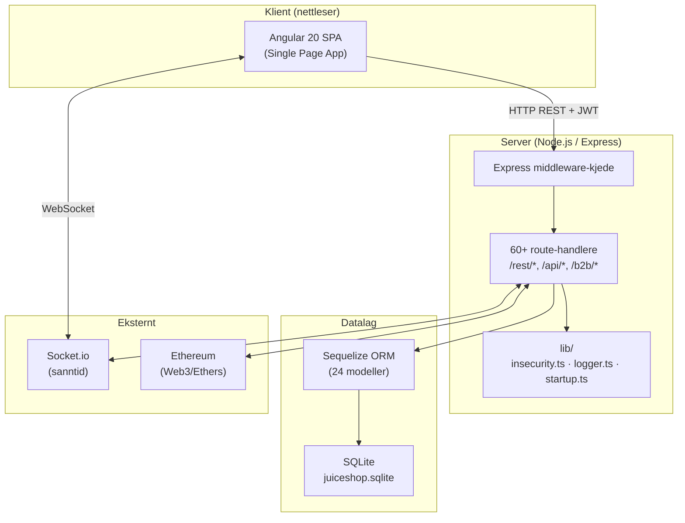
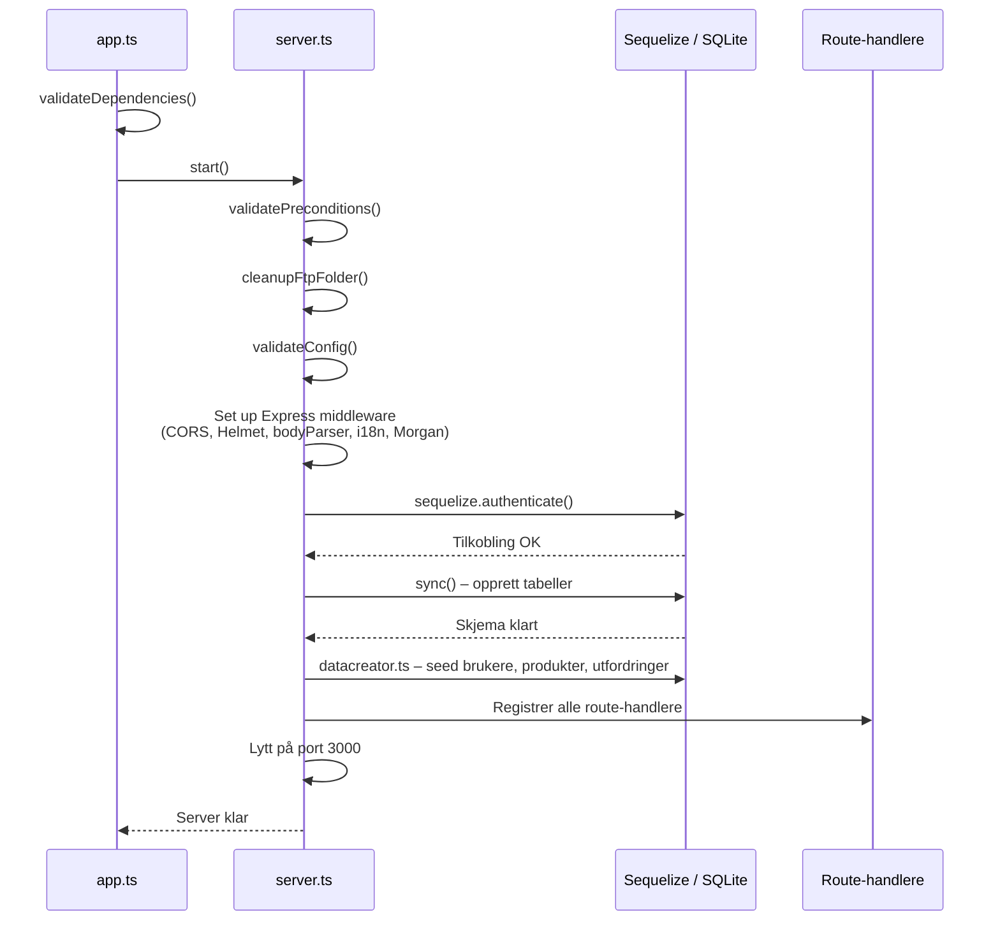
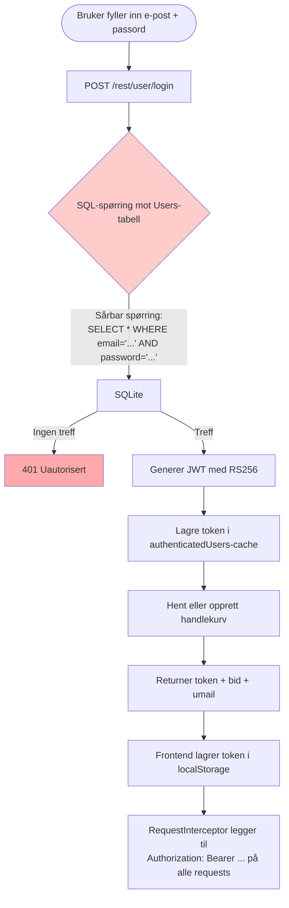
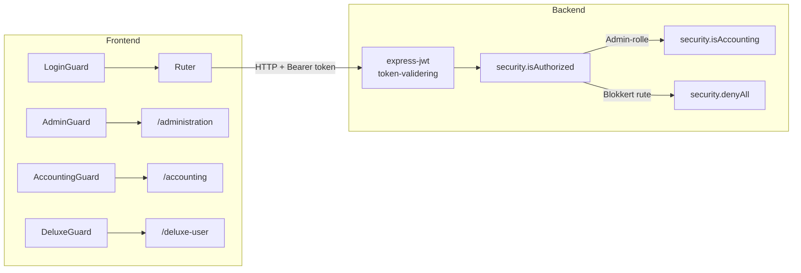
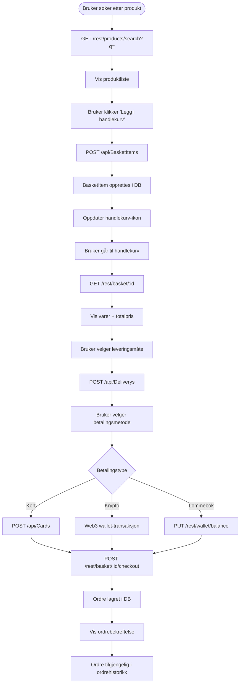
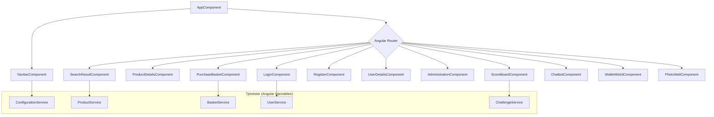
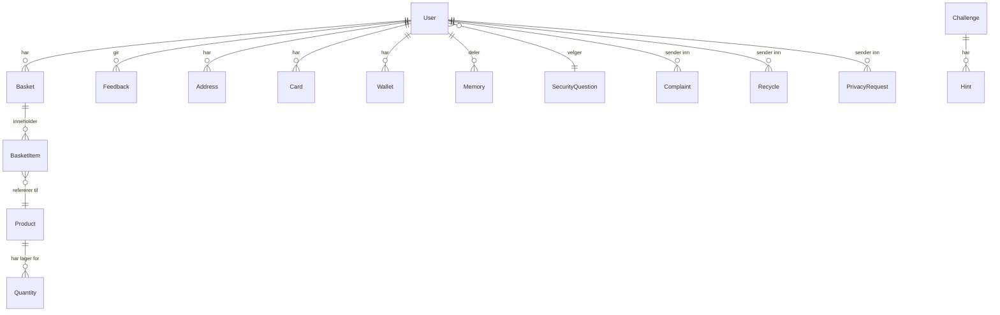
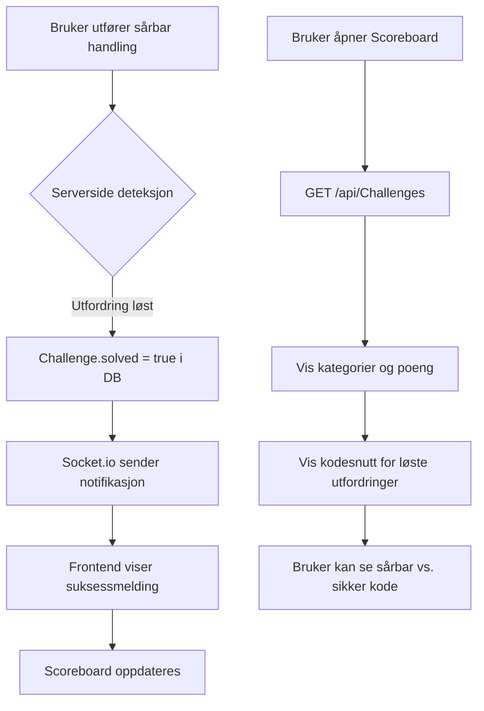

# Applikasjonsarkitektur – OWASP Juice Shop

OWASP Juice Shop er en **bevisst sårbar nettbutikk** brukt til sikkerhetsopplæring, CTF-konkurranser og penetrasjonstesting. Den simulerer en ekte e-handelsapplikasjon med innebygde sikkerhetssvakheter fra OWASP Top Ten.

---

## Teknologioversikt

| Lag | Teknologi |
|-----|-----------|
| Frontend | Angular 20, Angular Material, RxJS |
| Backend | Node.js, Express 4, TypeScript |
| Database | SQLite3 via Sequelize ORM |
| Auth | JWT (RS256), express-jwt |
| Realtime | Socket.io |
| Web3 | Ethers.js / Web3.js |
| Testing | Jest, Cypress, Frisby |

---

## 1. Overordnet arkitektur

---

## 2. Oppstartssekvens

---

## 3. Autentiseringsflyt (innlogging)

> **Merk:** SQL-spørringen er bevisst sårbar for SQL-injeksjon – dette er en del av læringsopplegget.

---

## 4. Autorisasjonsarkitektur

**Roller:** `customer` · `deluxe` · `accounting` · `admin`

---

## 5. Handlekurv og kjøpsflyt

---

## 6. Frontend-komponentstruktur

---

## 7. Databasemodeller

---

## 8. Utfordringssystem (CTF-mekanisme)

---

## 9. API-strukturoversikt

| Prefiks | Beskrivelse | Autentisering |
|---------|-------------|---------------|
| `GET/POST /rest/user/*` | Innlogging, profil, 2FA | Åpen + JWT |
| `GET/POST /api/*` | CRUD for alle ressurser (Sequelize Finale) | JWT |
| `POST /b2b/v2/orders` | B2B API | JWT |
| `GET /ftp/*` | Filserver (bevisst eksponert) | Ingen |
| `GET /encryptionkeys/*` | Krypteringsnøkler (bevisst eksponert) | Ingen |
| `GET /support/logs` | Servelogger (bevisst eksponert) | Ingen |
| `WS /` | Socket.io WebSocket | Token |

---

## 10. Sikkerhetssårbarheter (bevisste)

Applikasjonen inneholder bevisste svakheter fra OWASP Top Ten:

| Kategori | Eksempel i koden |
|----------|-----------------|
| SQL-injeksjon | `routes/login.ts` – direkte strenginterpolasjon i SQL |
| XSS | Produktanmeldelser og brukernavn uten sanitering |
| Svak krypto | MD5 brukt til passord-hashing (`lib/insecurity.ts`) |
| Sensitiv dataeksponering | `/ftp`, `/encryptionkeys` tilgjengelig uten autentisering |
| Broken Access Control | Manglende autorisasjonskontroller på flere endepunkter |
| CSRF | Manglende token-validering på statusendringer |

> Disse er **aldri** utilsiktede feil – de er læringsmål for sikkerhetsstudenter.
